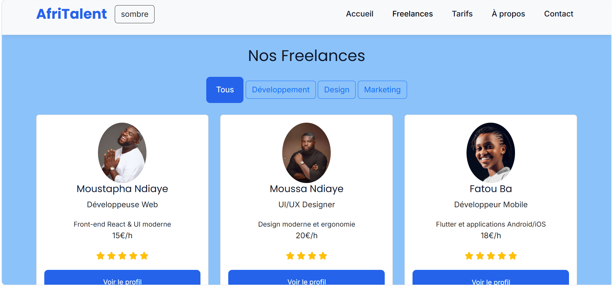
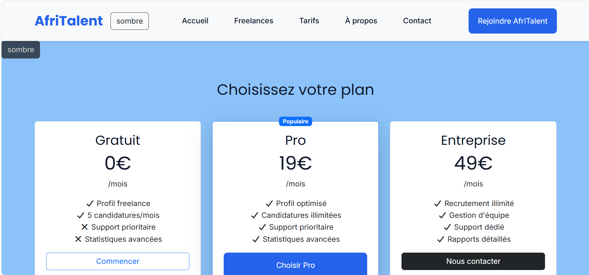
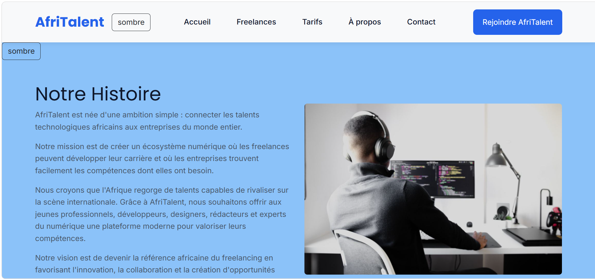
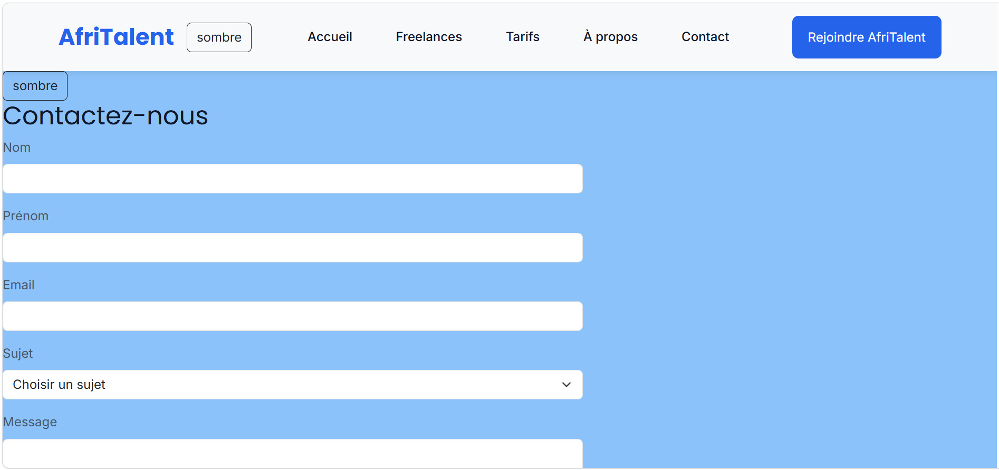

# AfriTalent

##  Description

AfriTalent est une plateforme web moderne qui connecte les freelances africains aux entreprises à la recherche de talents dans les domaines du développement, du design et du marketing digital.

## Fonctionnalités

 Présentation de la plateforme  
 Catalogue de freelances  
 Filtrage dynamique par catégorie (JavaScript)  
 Formulaire de contact avec validation  
 Compteurs animés  
 Témoignages interactifs  
 Design responsive (Bootstrap 5)  
 Animations et effets modernes  

##  Technologies utilisées

 HTML5  
 CSS3  
Bootstrap 5  
JavaScript (DOM, events, validation) 
Font-awosome

##  Déploiement

Site en ligne via GitHub Pages :

https://boiro9657-ship-it.github.io/BOIRO-Ibrahima-AfriTalent/

## Aperçu

